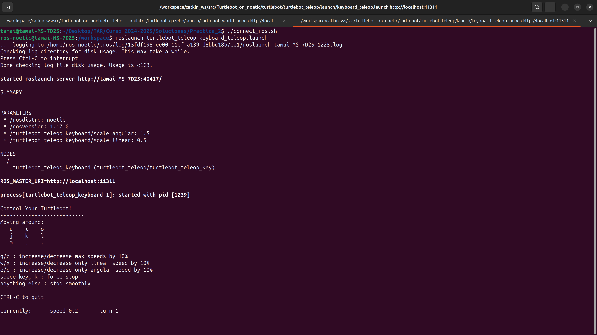

# Práctica 2: Turtlebot Simulado

## Entrega
La entrega de esta práctica se realizará a través de la herramienta de 'Evaluación' de UaCloud. La misma debe ser una memoria en formato `.pdf` en la cual se encuentren las respuestas a las preguntas teóricas y a los ejercicios propuestos de las diferentes partes. Deberá tener el nombre de *Apellidos_Nombre.pdf*. Asimismo, esta práctica se puede hacer tanto **individual como en parejas** (en el caso de ser en parejas el nombre del `.pdf` debe ser el primer apellido y nombre de los dos integrantes y en la memoria también se deben añadir, Ej: `Ramirez_Tamai_Pujol_Paco.pdf`). En esta práctica se deben entregar también los códigos que se hayan generado para resolver los ejercicios. Podéis o bien compartir un enlace al repositorio de `GitHub` que estéis usando, o añadirnos como colaboradores (Nuestros usuarios de github son TamaiRamirez y bigpacopujol, aunque nos añadáis como colaboradores, añadid el enlace al repositorio en la memoria) o compartir enlace de `Drive`, como prefiráis. Por otro lado, es recomendable que grabéis la resolución de los ejercicios y compartáis los videos en la memoria a través de un enlace también, así se puede observar la correcta ejecución de los ejercicios.

## Instalación

### Instalación Turtlebot 2

Para comenzar con la instalación del robot Turtlebot 2, es necesario tener ya generado un espacio de trabajo de ROS como `catkin_ws`. En este caso, lo que se va a hacer es descargar el paquete de ROS que contiene toda la información relevante para poder compilar el robot dentro del entorno de simulación. 

> Nota: Puedes emplear el espacio de trabajo `catkin_ws` que generaste en la práctica anterior, o bien clonar este repositorio en tu máquina local y tener cada práctica separada en diferentes carpetas, en este caso, debes generar de nuevo tu espacio de trabajo. Recomendamos usar la segunda opción, pero haz lo que mejor se adapte a ti.

A continuación, debemos lanzar nuestro contenedor de ROS Noetic, ejecutando o bien `run_nvidia.sh` o bien `run.sh`. Una vez dentro debemos ejecutar los siguientes comandos en la terminal:

```bash
cd catkin_ws/src
git clone https://github.com/hanruihua/Turtlebot_on_noetic.git
cd Turtlebot_on_noetic
sh turtlebot_noetic.sh

cd ../..

sudo apt-get install ros-noetic-sophus ros-noetic-joy libusb-dev libftdi-dev ros-noetic-base-local-planner ros-noetic-move-base-msgs

sudo apt-get install -y ros-noetic-image-geometry
sudo apt-get install -y ros-noetic-depth-image-proc

rosdep update
rosdep install --from-paths src --ignore-src -r -y

catkin_make
source devel/setup.bash
```

En otra terminal, fuera del contenedor, ejecuta lo siguiente para guardar la instalación en la imagen de `Docker`:
```bash
docker commit ros_noetic ros_noetic:latest
```

Para comprobar que funciona, ejecuta en una terminal el siguiente comando. Este comando abrirá Gazebo con el modelo del robot Turtlebot2 cargado:

> Nota: Gazebo es un simulador de robots en 3D que permite probar algoritmos, diseñar robots y realizar simulaciones físicas realistas en un entorno virtual. Se integra con ROS (Robot Operating System) y proporciona herramientas para modelar sensores, actuadores y dinámicas de robots en escenarios complejos.

```bash
roslaunch turtlebot_gazebo turtlebot_world.launch world_file:=/opt/ros/noetic/share/turtlebot_gazebo/worlds/empty.world
```

El resultado debe ser el siguiente:


> Nota: El Turtlebot 2 es un modelo muy antiguo, de la versión ROS Kinetic. Por ello, su paquetería se encuentra programada en Python 2 y es posible que al teleoperarlo o ejecutar nodos propios del paquete del robot, sea necesario modificar las cabeceras de los archivos `.py` del siguiente modo:

```python
#!/usr/bin/env python
```
Cambiar por:
```python
#!/usr/bin/env python3
```

### Instalación Turtlebot 3
De nuevo, debemos lanzar nuestro contenedor de ROS Noetic, ejecutanto o bien `run_nvidia.sh` o bien `run.sh`, si no lo hemos hecho anteriormente. Una vez dentro debemos ejecutar los siguientes comandos en la terminal:

```bash
cd catkin_ws/src/

# Clonamos el repositorio que contiene los paquetes del Turtlebot 3
git clone -b noetic-devel https://github.com/ROBOTIS-GIT/turtlebot3.git
git clone -b noetic-devel https://github.com/ROBOTIS-GIT/turtlebot3_msgs.git
git clone -b noetic-devel https://github.com/ROBOTIS-GIT/turtlebot3_simulations.git

# Compilamos los pauqetes
cd ..
catkin_make
source devel/setup.bash
```

El paquete del Turtlebot 3 integra tres opcciones de robot: `Burger, Waffle y Waffle Pi`. En nuestro caso, vamos a emplear el robot `Waffle` para la realización de esta práctica. A continuación, vamos a comprobar que todo se haya instalado y compilado de forma correcta. Para ello, vamos a simular el robot dentro del simulador `Gazebo`:

```bash
# Exportar el modelo de robot Turtlebot 3 (Esto debemos hacerlo siempre que se abra una nueva terminal)

export TURTLEBOT3_MODEL=waffle

# Lanzar la simulacion con el robot
roslaunch turtlebot3_gazebo turtlebot3_empty_world.launch
```

Al lanzar estos comandos debería abrirse `Gazebo` y mostrar lo siguiente: 


## Parte 1: Primeros Pasos con el Turtlebot y Odometría

En esta primera parte vamos a aprender a manejar el Turtlebot 2. Para ello debes lanzar la simulación del robot en `Gazebo` como se ha mencionado anteriormente. Una vez lanzado, lo primero que vamos a hacer es teleoperar el robot. En una nueva terminal ejecuta:

```bash
roslaunch turtlebot_teleop keyboard_teleop.launch
```

La terminal debe mostrar lo siguiente:



Como puedes observar, ahora con el teclado podemos teleoperar al robot y moverlo por el entorno de simulación. Con las teclas `i/,` el robot realizará un movimiento lineal hacia adelante/atrás, con las teclas `j/l` girará hacia la izquierda/derecha y con la tecla `k` se parará el robot. 

> Nota: El Turtlebot2 se teleopera por control de velocidad, esto quiere decir que lo único que podemos hacer es indicarle a qué velocidad deben girar las ruedas.

> Pregunta 1: ¿Cuál es el topic en el cual se debe publicar la información para que el robot se mueva?
>
> Pregunta 2: ¿Cuál es el tipo de mensaje que se publica?
>
> Pregunta 3: ¿Qué tipo de movimientos puede realizar el robot?
>
> Pregunta 4: ¿Cuál es la unidad de magnitud de las velocidades lineales y angulares?

### Ejercicios:

1. Genera un paquete de ROS con las dependencias necesarias llamado `p3_pkg`. En este paquete genera un nodo llamado `movimiento.py` que permita en base al valor entero pasado por la línea de comandos, realice los siguientes movimientos:
    - 0: Realizar un movimiento lineal haciendo que el robot avance 2 metros.
        > Pregunta 5: ¿Cómo puedo comprobar que el robot haya avanzado esta distancia? (Pista: Revisa los topics del robot)

    - 1: Realiza un movimiento que dibuje un triángulo equilátero, de forma que el robot vuelva a su posición inicial (aproximadamente). Cada lado del triángulo debe medir 3 metros.
    - 2: Realiza un movimiento que dibuje un cuadrado, de forma que el robot vuelva a su posición inicial (aproximadamente). Cada lado del cuadrado debe medir 1 metro.
    - 3: Realiza un movimiento que dibuje un "infinito", de forma que el robot vuelva a su posición inicial (aproximadamente). En este caso, el robot debe avanzar 0.5 metros y realizar un giro de 60º ($\pi$/3 radianes), a partir de aquí, el robot debe dibujar el "infinito" de forma que acabe en la misma posición que de partida (aproximadamente).

    <p align="center">
    
    </p>

    > NOTA: Para no tener que cancelar la simulación cada vez que quieras resetear el robot y ubicarlo en el origen, debes tanto resetear `Gazebo` como resetear la odometría del robot. Para ello, primero desde la ventana de `Gazebo` haz `Ctrl+R`. A continuación, resetea la odometría con el siguiente comando:
        
    ```bash
    rostopic pub -1 /mobile_base/commands/reset_odometry std_msgs/Empty "{}"
    ```

    Para comprobar cómo ha realizado el robot los movimientos, sería interesante que se "pinte" en un gráfico la posición del robot a lo largo del tiempo (usando la librería `matplotlib` que ya está instalada). En este caso, debes generar un nodo llamado `dibuja_mov.py`. Este nodo debe suscribirse al topic correspondiente y guardar las posiciones del robot para luego dibujarlas. 

    > Ayuda: El siguiente código se suscribe al topic `/odom` e imprime por pantalla la posición x e y del centro de la base del robot.

    ```python
    #!/usr/bin/env python3
    import rospy
    from nav_msgs.msg import Odometry

    def odom_callback(msg):
        x = msg.pose.pose.position.x
        y = msg.pose.pose.position.y
        rospy.loginfo(f"Robot Position: x={x:.2f}, y={y:.2f}")

    rospy.init_node("odometry_listener")
    rospy.Subscriber("/odom", Odometry, odom_callback)
    rospy.spin()
    ```

2. Ejecuta 10 veces el movimiento del cuadrado del Ejercicio 1 y dibuja el movimiento que realiza el robot como en el Ejercicio 1:
    > Pregunta 6: ¿El robot acaba en la posición original? ¿A qué puede deberse esto?

3. En este ejercicio vamos a comprobar qué tal se os da las habilidades de aparcamiento. El objetivo es emplear el Turtlebot 2 y desarrollar un nodo que ejecute el movimiento del aparcamiento y lo "aparque" dentro de un espacio concreto, el nodo debe llamarse `aparcamiento.py` dentro del paquete `p3_pkg`. Para poder cargar el entorno de simulación con el mapa para aparcar, debes añadir los directorios `models`, `worlds` y `launch`, que se encuentran en la carpeta `Parte_1`, en el directorio raíz del paquete. A continuación, para poder lanzar el robot debes ejecutar el siguiente comando una vez hayas compilado el paquete:
    ```bash
    roslaunch p3_pkg parking_tb2.launch
    ```
    Los datos de cómo se encuentra dispuesto el espacio donde aparcar los puedes visualizar en la siguiente imagen: 
<p align="center">
    
</p>

4. Repite los ejercicios anteriores, pero esta vez usando el modelo del Turtlebot 3 `Waffle` y contesta a las siguientes preguntas:
    > Pregunta 7: ¿El topic para publicar el mensaje de movimiento es el mismo que el del Turtlebot 2?
    >
    > Pregunta 8: Al ejecutar los mismos movimientos que el Turtlebot 2 del Ejercicio 1 y 2, ¿observas alguna diferencia en el movimiento comparativamente?
    >
    > Pregunta 9: En cuanto a la forma de teleoperar al robot o mandarle los comandos de velocidad que generan el movimiento, ¿qué diferencia notas respecto del Turtlebot 2?

    En este caso para realizar el aparcamiento, los comandos para lanzar el entorno de simulación con el Turtlebot 3 son:
    ```bash
    export TURTLEBOT3_MODEL=waffle
    roslaunch p3_pkg parking_tb3.launch
    ```

    Asimismo, para resetear la odometría de este robot primero desde la ventana de `Gazebo` haz `Ctrl+R`. A continuación, resetea la odometría con el siguiente comando:
        
    ```bash
    rosservice call /gazebo/reset_simulation "{}"
    ```

## Parte 2: Resolución de un Laberinto

En esta segunda parte de la práctica, se utilizará el Turtlebot 2 y Turtlebot 3 equipados con un sensor LiDAR para resolver un laberinto de manera autónoma. Para ello, deberán crear un nuevo paquete de ROS llamado `maze_pkg`, asegurándose de incluir todas las dependencias necesarias. Este paquete contendrá los nodos y scripts requeridos para la navegación del robot dentro del laberinto, empleando técnicas de percepción y control basadas en los datos obtenidos del LiDAR. Para comenzar, lanza en un mundo vacío por un lado el Turtlebot 2 y por otro el Turtlebot 3 y contesta a las siguientes preguntas para cada robot:

> Pregunta 1: ¿Cúal es el topic asociado al LiDAR? ¿Cuál es la tipología de los mensajes?
>
> Pregunta 2: ¿Cuál es el rango de **distancias** que puede medir LiDAR? ¿Cuál es el rango **angular de escaneo** que tiene el LiDAR? ¿Cual es el **origen de referencia** del LiDAR?

### Ejercicios:
1. El objetivo es emplear el Turtlebot 2 y desarrollar un nodo que haga que el robot logre "escapar" del laberinto, el nodo debe llamarse `res_maze.py` dentro del paquete `maze_pkg`. Para poder cargar el entorno de simulación con el mapa con el laberinto, debes añadir los directorios `models`, `worlds` y `launch`, que se encuentran en la carpeta `Parte_2`, en el directorio raíz del paquete. A continuación, para poder lanzar el robot debes ejecutar el siguiente comando una vez hayas compilado el paquete:
    ```bash
    roslaunch maze_pkg maze_tb2.launch world_file:=/workspace/catkin_ws/src/maze_pkg/worlds/maze_1.world
    ```

2. Como puedes observar en la carpeta `worlds` existe otro mapa con otro modelo de laberinto llamado `maze_2.world`. Ejecuta este nuevo entorno en `Gazebo` y lanza de nuevo el algoritmo de resolución que hiciste en el Ejercicio 1. Añadido a esto, contesta a las siguientes preguntas:

    > Pregunta 3: ¿Qué problematica observas en este tipo de escenarios? 
    >
    > Pregunta 4: ¿Es el robot capaz de resolver este labertinto? Si no es así, justifica tu respuesta. ¿Qué información crees que necesita el robot para poder llegar a resolverlo?

3. Repite los Ejercicios anteriores empleando el Turtlebot 3, respondiendo también a las preguntas asociadas a los Ejercicios.

4. **EJERCICIO OPCIONAL (+1.5 punto):** El robot real Turtlebot 2 tiene un rango de escaneo angular y de distancias del LiDAR diferente al del robot simulado. Investiga como modificar los parámetros del robot simulado en ROS para que tenga el mismo rango que el robot real. Prueba a resolver los Ejercicios 1 y 2 de nuevo empleando este nuevo rango del LiDAR. Asimismo, responde a la siguiente pregunta:

    > Pregunta 5: ¿Ofrece mejor rendimiento este rango del LiDAR? ¿Qué diferencias notas respecto al rango del LiDAR simulado?

6. **EJERCICIO OPCIONAL (+1.5 puntos):** En este ejercicio se pide que generes un nuevo laberinto a tu gusto y que pruebes con los dos Turtlebot a resolverlo. Para ello, tendrás que investigar sobre cómo generar modelos y mapas en `Gazebo` para luego cargarlos. Como guía para el laberito puedes usar el siguiente generador [Maze Generator](https://mazegenerator.net/). Obviamente, cuanto más complejo sea el laberinto mejor valoración se tendrá y sobretodo si los robots logran resolverlo.